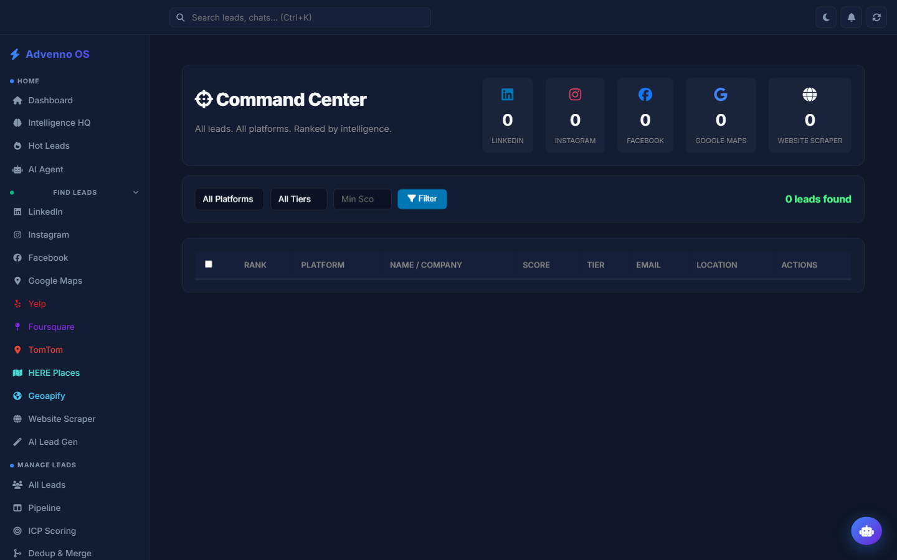
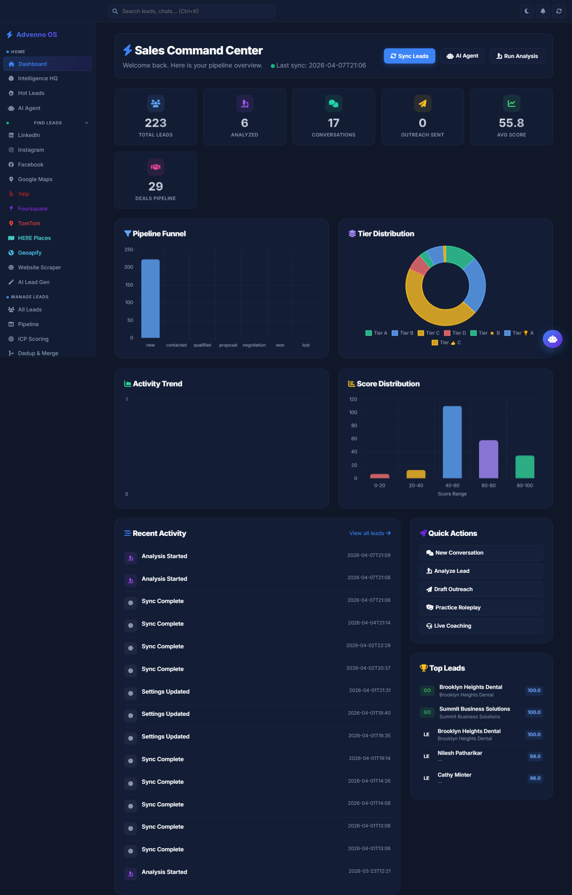
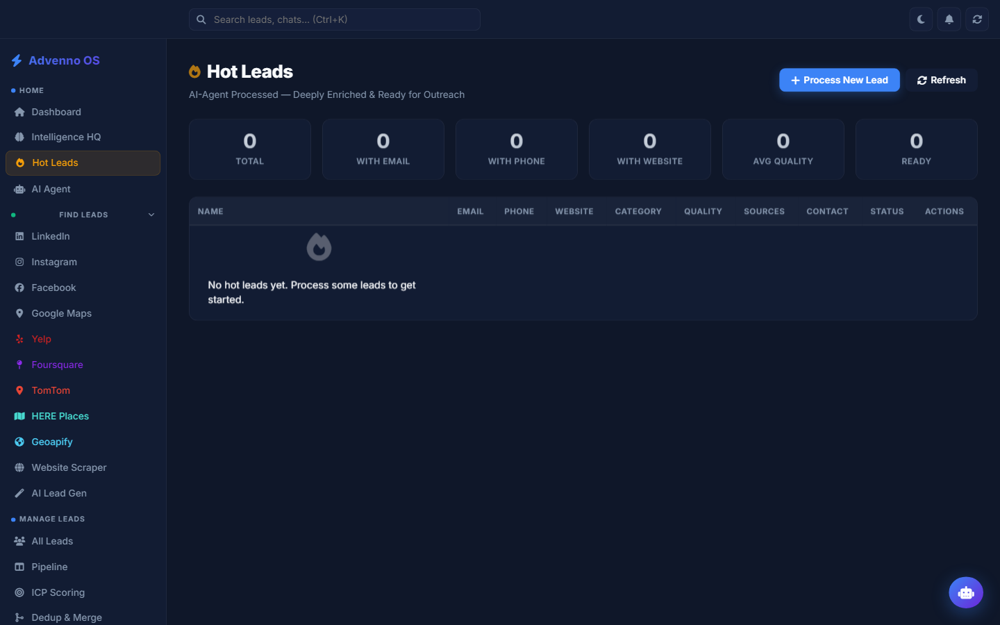
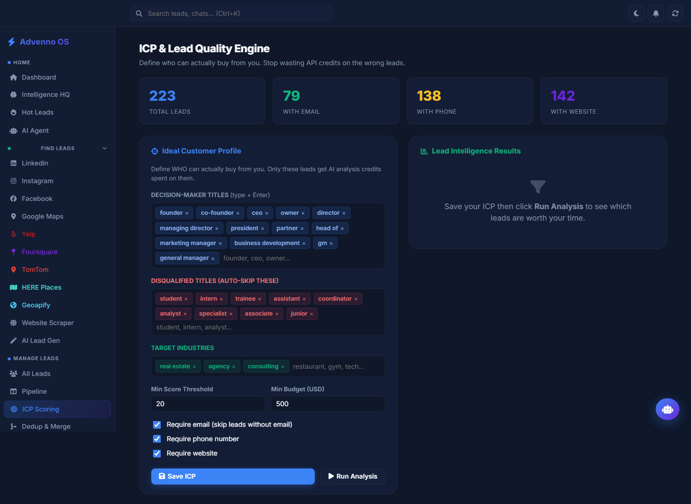
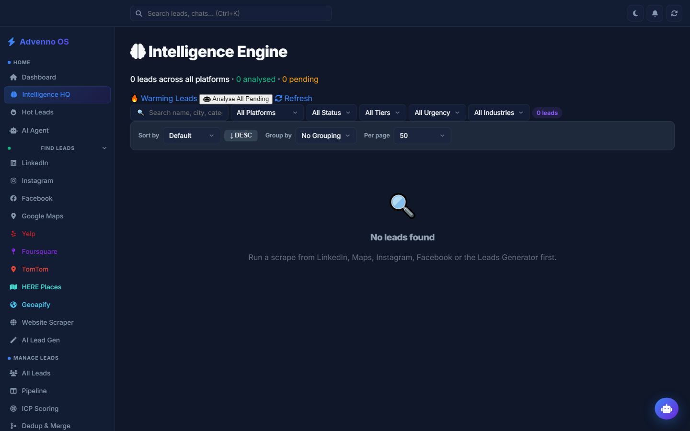

# AI Sales Agent - Automated Lead Generation and Outreach

> Agentic pipeline that finds, enriches, qualifies and contacts B2B leads across multiple data sources.

Built by **[Muhammad Tanveer](https://www.linkedin.com/in/muhammad-tanveer-advenno/)** - Full-Stack AI Automation Engineer.

 

## Contents

- [The problem](#the-problem)
- [The approach](#the-approach)
- [Architecture](#architecture)
- [Tech stack](#tech-stack)
- [Key capabilities](#key-capabilities)
- [Screenshots](#screenshots)
- [Results](#results)
- [FAQ](#faq)
- [Source code and access](#source-code-and-access)
- [About the engineer](#about-the-engineer)
- [Related projects](#related-projects)

## The problem

Outbound prospecting meant manually searching directories, copying company details into a sheet, guessing which leads were worth contacting, and writing each message by hand. The work did not scale and quality varied with whoever was doing it.

## The approach

A staged agent pipeline: discovery pulls candidates from several sources, enrichment fills in firmographic and contact data, an analysis stage scores fit, and an outreach stage drafts channel-appropriate messages. A command centre exposes each stage so a human can inspect and intervene rather than trusting an opaque end-to-end run.

## Architecture

| Component | Responsibility |
| --- | --- |
| **Discovery** | Multi-source lead sourcing including Facebook and Foursquare connectors |
| **Enrichment** | Contact and firmographic completion |
| **Analysis** | Fit scoring and qualification |
| **Chat and outreach** | Message drafting per channel |
| **Command centre** | Operator view over every pipeline stage |

## Tech stack

| Layer | Technology |
| --- | --- |
| Language | Python |
| Agent layer | LLM-driven analysis and drafting |
| Sources | Directory and social data connectors |
| Interface | Command centre UI |

## Key capabilities

- Multi-source lead discovery
- Automated enrichment and deduplication
- LLM fit scoring and qualification
- Channel-aware outreach drafting
- Operator command centre with stage-level visibility

## Screenshots

## Results

- Manual directory research replaced by a repeatable pipeline
- Qualification applied consistently instead of per-operator judgement
- Human review retained at each stage rather than a black-box run

## FAQ

### Is this a scraper?

No - scraping is only the discovery stage. The value is in enrichment, scoring and channel-aware drafting on top of it.

### How is lead quality controlled?

An analysis stage scores fit against the target profile, and the operator can inspect and reject at every stage.

### Which channels does outreach cover?

Message drafting is channel-aware, with the operator approving before anything is sent.

### Where is the code?

Private repository; access on request.

## Source code and access

This repository is the public case study for **AI Sales Agent - Automated Lead Generation and Outreach**. The full implementation - application code, database schema, tests and deployment configuration - lives in a **private repository** on this account, alongside the rest of the work shown here.

Source access can be arranged for hiring conversations, technical review or client due diligence. The quickest route is a short message on [LinkedIn](https://www.linkedin.com/in/muhammad-tanveer-advenno/) or an email to [mtanveertahir6666@gmail.com](mailto:mtanveertahir6666@gmail.com).

## About the engineer

**Muhammad Tanveer - Full-Stack AI Automation Engineer**

Full-stack AI automation engineer. I build agentic systems, browser and workflow automation, RAG pipelines and the production web platforms they run on - from Rust and Python services to Next.js dashboards and PHP/MySQL business systems.

- GitHub: [haddindeve](https://github.com/haddindeve)
- LinkedIn: [Muhammad Tanveer](https://www.linkedin.com/in/muhammad-tanveer-advenno/)
- Email: [mtanveertahir6666@gmail.com](mailto:mtanveertahir6666@gmail.com)
- Location: Pakistan

## Related projects

- [Doctern - AI Document OCR and Table Extraction](https://github.com/haddindeve/doctern-document-ocr-ai)
- [Lunaria - Privacy-First Women's Wellness App](https://github.com/haddindeve/lunaria-womens-wellness-app)
- [Exporter Lead Generator - AI B2B Buyer Discovery](https://github.com/haddindeve/exporter-lead-generator-ai)
- [ATM Electronic Journal Parser and GL Reconciliation](https://github.com/haddindeve/ej-rolls-atm-reconciliation)
- [Gym Management CRM with NFC Gate Control](https://github.com/haddindeve/gym-management-crm-system)
- [CRAlign - AI Musculoskeletal Wellness Assessment](https://github.com/haddindeve/cralign-msk-wellness-ai)

---

AI Sales Agent - Automated Lead Generation and Outreach - case study by Muhammad Tanveer - Full-Stack AI Automation Engineer. Keywords: AI sales agent, automated lead generation, lead enrichment pipeline, B2B prospecting automation, multi-channel outreach, agentic sales workflow.